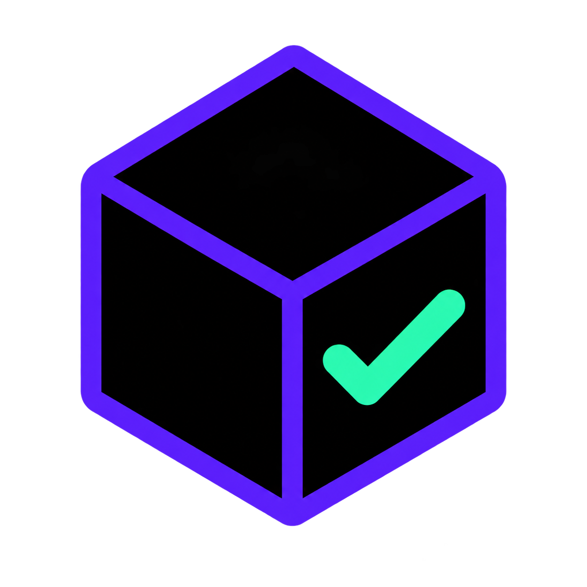

# pytest-blackbox



Black-box pytest contract testing workflows for Codex and Claude Code.

Pytest Blackbox helps coding agents discover, write, repair, review, and audit
Python contract tests through public application boundaries. It is designed for
HTTP and JSON-RPC APIs, jobs, schedulers, workers, message handlers, databases,
caches, object stores, brokers, and outbound HTTP integrations.

> **Status:** early release, distributed directly from GitHub. Publication in
> public plugin directories is deferred.

## What it optimizes for

- Public contracts instead of implementation details.
- The real composed application instead of unit tests.
- Independent inputs and expectations instead of production-derived oracles.
- No mocking or monkeypatching of application source internals.
- Protocol-compatible test infrastructure with isolated logical resources.
- Deterministic completion without sleeps, retry delays, or messaging timeouts.
- Fixture-owned lifecycle, cleanup, configuration, and application composition.
- Focused cases with readable parameter IDs and explicit observable outcomes.

The complete policy is documented in [core/POLICY.md](core/POLICY.md). Project
choices, such as test layout and external-service strategy, are recorded in the
project's existing `pyproject.toml` rather than in a separate plugin config.

## Workflows

| Workflow | Purpose |
| --- | --- |
| `discover` | Inspect a project read-only and propose project-wide test policy. |
| `lint` | Run deterministic machine-checkable policy diagnostics. |
| `write` | Add black-box contract coverage for requested application behavior. |
| `repair` | Diagnose and repair existing failing or nondeterministic tests. |
| `review` | Perform a focused, read-only review of tests or a test diff. |
| `audit` | Audit a complete suite or explicitly named full component surface. |

All workflows support model-driven automatic invocation. They can also be
invoked explicitly.

### Codex

```text
$pytest-blackbox:discover
$pytest-blackbox:lint
$pytest-blackbox:write
$pytest-blackbox:repair
$pytest-blackbox:review
$pytest-blackbox:audit
```

### Claude Code

```text
/pytest-blackbox:discover
/pytest-blackbox:lint
/pytest-blackbox:write
/pytest-blackbox:repair
/pytest-blackbox:review
/pytest-blackbox:audit
```

## Installation

The plugin is distributed only through its GitHub repository. Both hosts use a
small GitHub-backed marketplace catalog so the plugin remains installable and
updatable without a public directory listing.

### Codex

Add the GitHub repository as a marketplace, then install the plugin:

```bash
codex plugin marketplace add ave-satan/pytest-blackbox-skill
codex plugin add pytest-blackbox@ave-satan
```

Start a new Codex task after installation so the workflows are discovered.

To update an existing installation:

```bash
codex plugin marketplace upgrade ave-satan
codex plugin add pytest-blackbox@ave-satan
```

### Claude Code

Inside Claude Code, add the same GitHub repository and install the plugin:

```text
/plugin marketplace add ave-satan/pytest-blackbox-skill
/plugin install pytest-blackbox@ave-satan
```

If Claude Code asks for it, run `/reload-plugins` after installation. To fetch
new releases later, run `/plugin marketplace update ave-satan`; third-party
marketplace auto-updates are disabled by default.

### Development checkout

Clone the repository when you want to inspect or modify the plugin locally:

```bash
git clone https://github.com/ave-satan/pytest-blackbox-skill.git
cd pytest-blackbox-skill
```

Claude Code can load that checkout directly without installing it:

```bash
claude --plugin-dir ./
```

## Project onboarding

On first use, Pytest Blackbox looks for `[tool.pytest-blackbox]` in the nearest
applicable `pyproject.toml`. If it is absent, the `discover` workflow:

1. Scans project structure without importing or starting the application.
2. Proposes material project-wide choices with confidence and evidence.
3. Asks only about ambiguous choices plus the explicit managed-dependency opt-in.
4. Shows the exact `pyproject.toml` patch before writing anything.

Recommended defaults for a new suite are:

```toml
[tool.pytest-blackbox]
config_version = 1
layout = "standard"
prefer_test_classes = true
infrastructure = "existing-services"
compose_lifecycle = "disabled"
external_services = "intercept"
generators_backend = "faker"
```

Onboarding also asks whether the plugin may install its enhanced analysis
toolchain and later concrete missing Python dependencies into a dedicated
project group. This opt-in capability is omitted when declined; when enabled,
the default is:

```toml
[tool.pytest-blackbox]
dependency_group = "dev-ai"
```

The baseline toolchain is Ruff, Packaging, PathSpec, and TOMLKit. It is
installed through the project's package manager only after confirmation. The
plugin itself is still installed through Codex or Claude Code; runtime and
general development groups remain untouched.

See [references/configuration.md](references/configuration.md) for the complete
schema, adaptive choices, and non-public coverage registry.

## Bundled tooling

The plugin includes bundled fallback commands and an opt-in enhanced mode:

```bash
python scripts/discover_project.py /path/to/project
python scripts/lint_suite.py /path/to/project
python scripts/audit_suite.py /path/to/project
```

- `discover_project.py` gathers onboarding evidence without importing project
  code, reading common secret files, starting infrastructure, or mutating the
  project.
- `lint_suite.py` emits mechanically provable diagnostics in Ruff-like text or
  JSON.
- `audit_suite.py` adds the preserved semantic review section, including every
  applicable `SEM*` requirement.

All three commands support `--mode auto|fallback|enhanced`. Auto mode stays on
the bundled fallback until `dependency_group` is confirmed and the
enhanced toolchain is available. See
[references/tooling.md](references/tooling.md) for exact requirements and mode
semantics.

The helpers require Python 3.10 or newer. On Python 3.11+ fallback uses only the
standard library; Python 3.10 requires the `tomli` compatibility dependency,
which is included conditionally in the confirmed enhanced baseline.

## Repository structure

```text
pytest-blackbox-skill/
├── .agents/plugins/marketplace.json
├── .claude-plugin/
│   ├── marketplace.json
│   └── plugin.json
├── .codex-plugin/plugin.json
├── assets/
├── core/POLICY.md
├── references/
├── scripts/
├── submission/
└── skills/
    ├── audit/
    ├── discover/
    ├── lint/
    ├── repair/
    ├── review/
    └── write/
```

The shared policy lives outside `skills/` so it is loaded by the selected
workflow without becoming a duplicate `pytest-blackbox:pytest-blackbox`
command.

## Contributing

Issues and pull requests are welcome. Please open an issue before proposing a
broad policy change: universal rules should be backed by repeatable failures or
clear contract-testing invariants rather than a single project convention.

## Support and legal

- Report non-sensitive bugs and request features through
  [GitHub Issues](https://github.com/ave-satan/pytest-blackbox-skill/issues).
- Review the [Privacy Policy](PRIVACY.md) and [Terms of Use](TERMS.md).
- Do not post secrets, credentials, proprietary source code, or personal data in
  public issues.

## License

Distributed under the [MIT License](LICENSE). Copyright © 2026 ave-satan.
